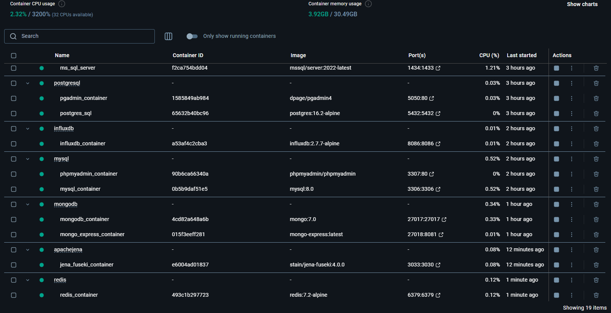

<a href='https://github.com/Junwu0615/One-Click-Database-Deployment'> 
<a href='https://github.com/Junwu0615/One-Click-Database-Deployment'> <br>
[](https://github.com/Junwu0615/One-Click-Database-Deployment)
[](https://github.com/Junwu0615/One-Click-Database-Deployment)
[](https://www.python.org/) <br>

<br>

## *⭐ 一鍵部署各類型資料庫 ( RDBMS / NoSQL ) ⭐*

### *A.　Current Progress*
|項目|敘述|完成時間|
|:--:|:--:|:--:|
| 專案上架 | - | 2025-02-28 |
| SQL Server | RDBMS  | 2025-09-25 |
| PostgreSQL | RDBMS  | 2025-09-26 |
| MySQL | RDBMS  | 2025-09-26 |
| Oracle | RDBMS  | - |
| InfluxDB | NoSQL  | 2025-09-26 |
| MongoDB | NoSQL  | - |
| Redis | NoSQL  | - |
| HBase | NoSQL  | - |
| Neo4j | NoSQL  | - |
| DynamoDB | NoSQL  | - |
| Docker Backup | T-SQL | - |
| Docker Backup | Docker Volume | - |
| Docker Backup | Volume Plugins | - |

<br>

### *B.　Objective*
- #### *學習 RDBMS & NoSQL 差異性*
- #### *試著建構一鍵部署資料庫的建置*
- #### *測試方式*
  - #### *Docker Compose 形式啟動服務*
  - #### *成功連接資料庫*
  - #### *基本的 CRUD*

<br>

### *C.　Deploy DB Build*
- #### *啟動 docker-compose*
  ```bash
  docker-compose up -d
  ```

- #### *檢視服務是否正確啟用*
  ```bash
  docker ps -a
  ```
  
- #### *檢視資料持久化清單*
  ```bash
  docker volume ls
  ```

- #### *關閉服務*
  ```bash
  docker-compose down
  ```

- #### *[ 不建議 ] 關閉服務並清除 Volume*
  ```bash
  docker-compose down -v
  ```
  
- 
- 

<br>

### *D.　Volume Backup*
- #### *使用 T-SQL 指令備份*
- #### *直接複製 Docker Volume 內容*
- #### *使用 Docker Volume 外掛程式 ( Volume Plugins )*

<br>

### *E.　Notice*
- #### *設定重啟策略 : 建議使用 unless-stopped，而非 always ( 避免無限重啟循環 )*
